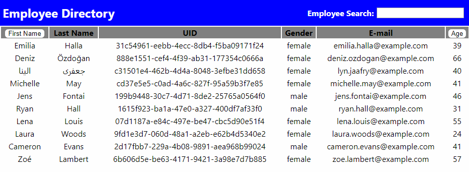

# Employee Directory
Homework assignment where the goal is make an employee directory using React.js, populating it with random employees from an api, and allowing the user to search/sort the results.

## Description 
Primary goal of app was to use React for the first time. The app takes in a set of random employees from the API Random User Generator (randomuser.me). It stores the random employees in context. The employees are mapped over and displayed in a table format. The user is able to sort the employees by first name or age by clicking on the column name. The user is also able to search by the users first name with the search input.

This project was bootstrapped with [Create React App](https://github.com/facebook/create-react-app).

## Deployed App
https://competent-ptolemy-3cbc9e.netlify.com/

## Images
GIF demonstrating the Employee Directory

## Installation
#### Available Scripts

In the project directory, you can run:

#### `npm start`

Runs the app in the development mode. 
Open [http://localhost:3000](http://localhost:3000) to view it in the browser.

The page will reload if you make edits. 
You will also see any lint errors in the console.

